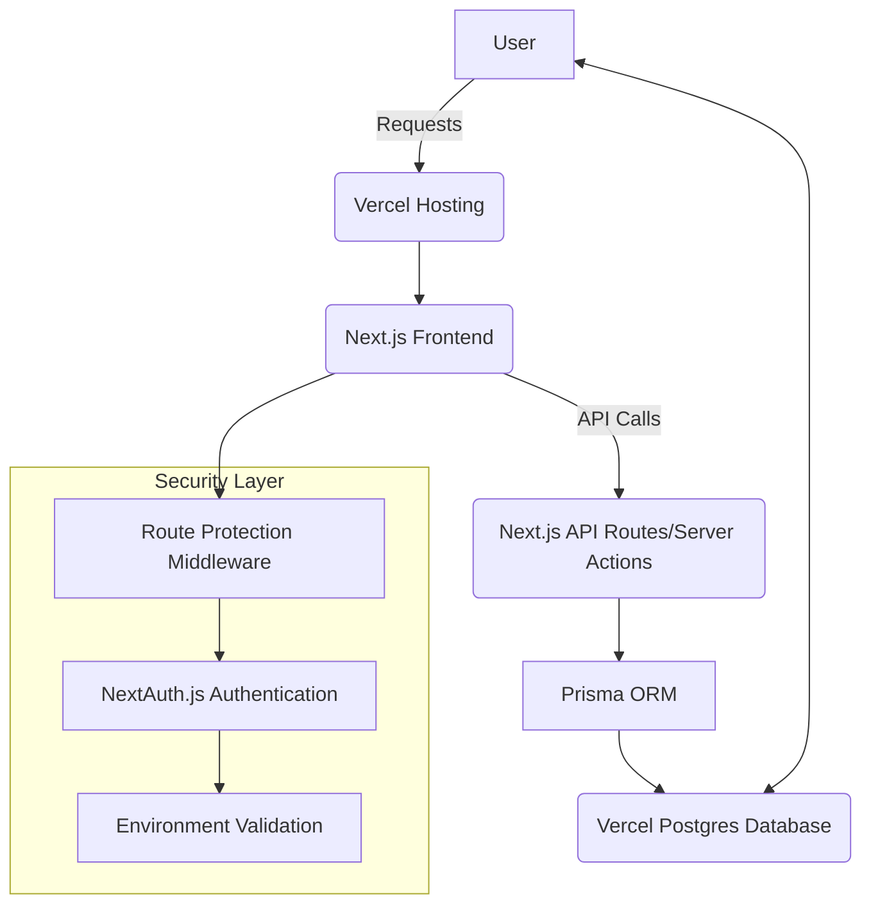

# TDH Agency Leave Tracker Fullstack Architecture Document

## Introduction
This document outlines the complete full-stack architecture for the TDH Agency leave tracker, including backend systems, frontend implementation, and their integration. It serves as the single source of truth for AI-driven development, ensuring consistency across the entire technology stack.

---

## High Level Architecture

### Technical Summary
The application uses a modern full-stack monorepo architecture built on the Next.js framework. This approach allows for a unified codebase for both the frontend (React) and the backend (Next.js API routes/server actions). All data is managed through a PostgreSQL database via the Prisma ORM. The architecture includes comprehensive security features with environment validation, route protection middleware, and role-based access control. This architecture is designed for a smooth AI-assisted development workflow, focusing on predictability and convention over configuration.

### Platform and Infrastructure Choice
**Platform**: Vercel/Next.js
**Key Services**: Vercel Hosting, Vercel Postgres
**Deployment Host and Regions**: United Kingdom (London)

### Repository Structure
**Structure**: Monorepo
**Monorepo Tool**: None (using native Next.js features)
**Package Organization**: The application will use a flat directory structure for clarity.

### High Level Architecture Diagram

---

## Security Architecture

### Authentication & Authorization
- **NextAuth.js v5**: JWT-based authentication with secure session management
- **Role-Based Access Control**: User and Admin roles with middleware protection
- **Route Protection**: Automatic middleware protection for all non-public routes
- **Environment Validation**: Zod schema validation for all environment variables

### Security Features
- **Type-Safe Environment Variables**: Full TypeScript support with validation
- **Secure Secret Generation**: Automated script for generating cryptographically secure secrets
- **Database Security**: PostgreSQL with Prisma ORM for type-safe database operations
- **Session Management**: Secure JWT tokens with configurable expiration

### Environment Management
- **Validation Schema**: All environment variables validated at startup
- **Development vs Production**: Separate configurations for different environments
- **Secret Management**: Secure handling of sensitive configuration values

---

## Implementation Status

### ✅ Completed (Chunk 1.1 - Security & Environment Setup)
- [x] Environment validation with Zod schema (`src/lib/env.ts`)
- [x] Route protection middleware (`src/middleware.ts`)
- [x] Secure secret generation script (`scripts/generate-secret.js`)
- [x] Updated auth configuration with environment validation
- [x] Enhanced documentation and setup guide
- [x] PostgreSQL migration with proper syntax
- [x] Type-safe environment variables

### 🔄 In Progress
- [ ] Database seeding and testing (Chunk 1.2)
- [ ] API standardization (Chunk 2.1)
- [ ] Reusable components (Chunk 2.2)

### 📋 Planned
- [ ] Form handling upgrade (Chunk 2.3)
- [ ] Leave request submission (Chunk 3.1)
- [ ] Leave balance & history (Chunk 3.2)
- [ ] Admin features (Chunk 3.3)
